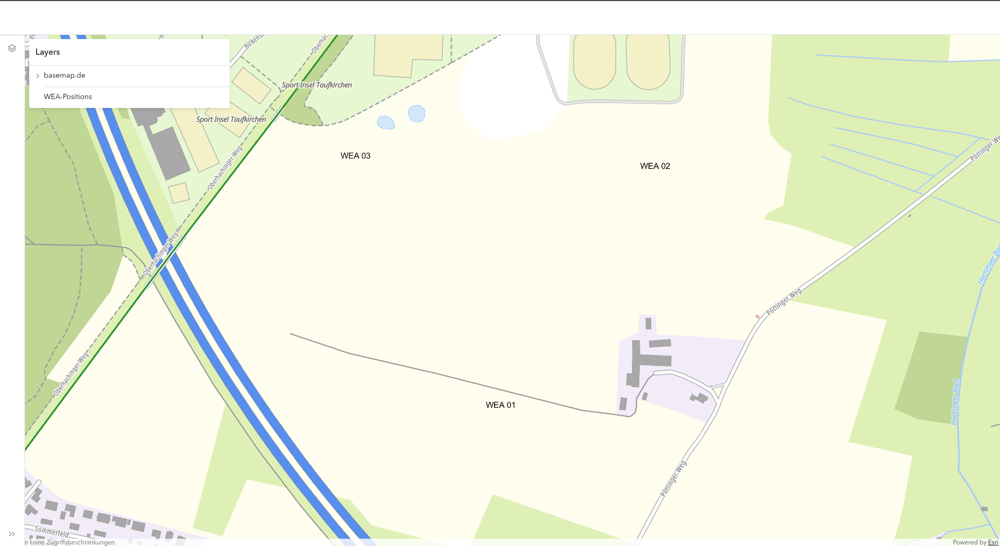

# Issue with client-side FeatureLayer  labeling and MSLayer ordering

This sample app show cases an issue with client-side FeatureLayer labeling.
The problem is, that the labels are shown above the WMSLayer, even
though the FeatureLayer is below the WMSLayer in the layer stack.

The image below shows the issue clearly, as the labels are obviously not
part of the WMSLayer and that they should be hidden behind the WMSLayer.

The demo app is based on the ArcGIS Maps SDK for JavaScript 5.0.0-next.43.

It can be accessed [here](https://sebastianfrey.github.io/arcgis-labeling-client-side-feature-layer-issue/)

